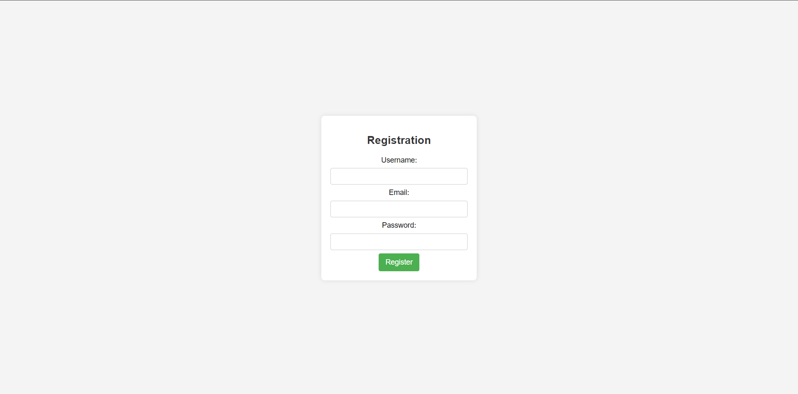

# Zeta Shop

### General Information:
The purpose of the "Zeta Shop" project is to establish and operate a laptop store that caters to customers in need of high-quality laptops and related accessories. The primary objective is to provide a diverse range of laptops from various brands, ensuring that customers have access to a wide selection of devices to meet their specific requirements.

### Key Features and Functions:

* **Product Catalog:** Zeta Shop will maintain a comprehensive product catalog featuring the latest laptop models, including specifications, features, and pricing details.

* **User-friendly Interface:** The project will incorporate a user-friendly interface for easy navigation, allowing customers to browse through the product catalog, filter options, and find the laptops that best suit their needs.

* **Secure Online Shopping:** Zeta Shop will enable secure online transactions, allowing customers to purchase laptops and accessories with confidence. This involves implementing secure payment gateways and encryption protocols.

* **Order Tracking:** The project will offer order tracking functionality, enabling customers to monitor the status of their purchases from the time of order placement to delivery.

* **Customer Support:** Zeta Shop will provide customer support services to address inquiries, concerns, and provide assistance throughout the shopping process. This may include live chat, email support, and a dedicated customer service hotline.

* **Target Users:**
The primary target users for Zeta Shop include individuals and businesses in need of laptops and related accessories. This encompasses students, professionals, freelancers, and anyone seeking reliable computing devices. The store aims to appeal to a broad audience by offering a diverse range of products to meet various computing needs.

Overall, the Zeta Shop project aims to create a convenient and reliable platform for purchasing laptops, providing a seamless online shopping experience for its diverse customer base.

### Installation Guide:
1. Install Golang: https://golang.org/dl/.
2. Run the server: `go run main.go`.
3. Use Postman or any HTTP client to send POST requests with JSON data to http://localhost:8080/login.html.

### Participants: 
* Abdukarimov Sultan
* Baitenov Arsen
* Kakimov Aldiyar
